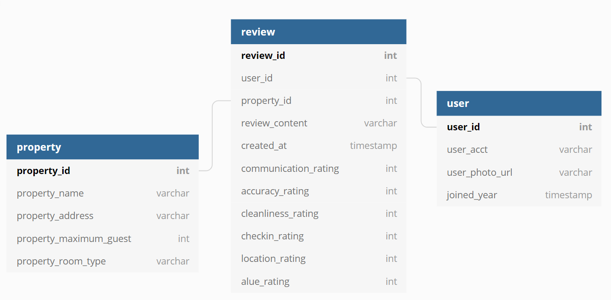

# Setup
How to start this component?

1. npm install
2. run 'mysql -u root -p < database/schema.sql' command in the terminal to create database and table
3. npm run seed-database
4. npm run react-dev
5. npm run start

Note: If "npm install runs into error, try command "npm cache clean --force"

# Databases
## Database Chosen
Objective: This project will compare 2 of the chosen databases with considerations of CAP (Consistency, availability, and partition tolerance) requirement, budget, and simplicity. 

MySQL: I choose to test MySQL because it is available for free (budget consideration). Compared to other relational databases, it is simpler to use as it was found in 1995. Consistency is important for the booking section that involves money, but not necessary for the review section. With economics of scale, however, it would be cheaper to utilize one major database instead of multiple databases. My databases contains structured data, which should expect to run faster in
MySQL than NoSQL databases. In term of scalability, it is possible, but more of a hassle to set up as compared to MongoDB. Compared to PostgreSQL, MySQL is better for database replication for grown company.

MongoDB: The other database that I will test against is MongoDB which is known to meet the need as data grow unbounded through horizontal scaling. In case of high transaction rate with over thousands of requests per seconds, I would need multiple databases servers to spread out the loads more evenly, as compared to monolithic database like MySQL. The downside of MongoDB is that the default setting does not have security setting set up and outsiders can retrieve and write data. The security setting requires expertise to set it up. Smaller companies can rely on professional paid support or outsource to guide through the setup decision overtime which MongoDB offers in the marketplace. Compared to other NoSQL databases, mongoDB has better external supports.

Format: 